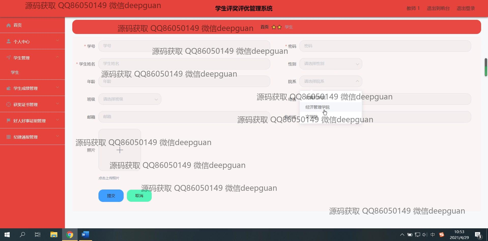
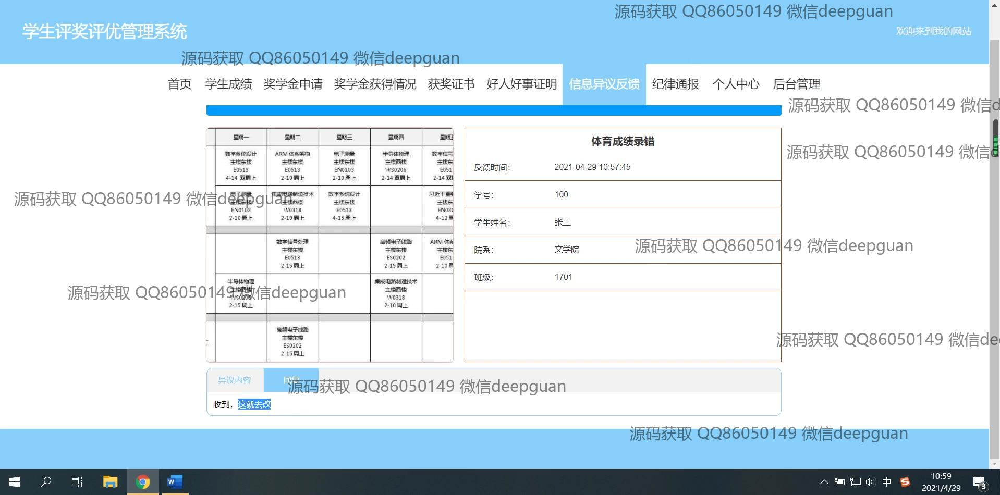

<h1 align="center">学生评奖评优管理系统的设计与实现</h1>

## 简介
学生评奖评优管理系统：角色分为管理员、用户；提供个人中心、学生管理、成绩管理、奖学金申请与审核、违纪记录、信息反馈等功能，旨在提高评奖评优过程的效率和透明度。    --计算机毕业设计源码；毕设源码；java毕业设计源码

## 联系方式

<h3 align="center">获取完整代码与数据库文件 + 微信：deepguan QQ: 86050149 QQ群: 783742310</h3>

<h3 align="center">可帮忙远程部署 包运行成功！提供远程部署、修改代码、设计文档指导、代码讲解等服务！</h3>

## 功能介绍（完整见运行截图）
管理员：基本功能包括登录、注册和退出系统。系统提供首页导航，供管理员查看和管理网站内容。管理员可管理学生信息、教师信息、院系信息、班级信息，并处理成绩录入、奖学金申请和反馈。系统支持纪律管理、评选流程监督与结果公示，各模块设计旨在提升管理效率。

学生：学生可使用系统进行登录注册，查看和更新个人信息。系统提供学生成绩查询、奖学金申请、获奖情况查看及申诉反馈功能。学生可以录入个人好人好事记录，并上传相应材料。同时，学生可在系统中了解和参与各类评优评奖活动，通过导航栏访问各模块进行管理。

## 运行截图

本代码来源于网络,仅供学习参考使用!

